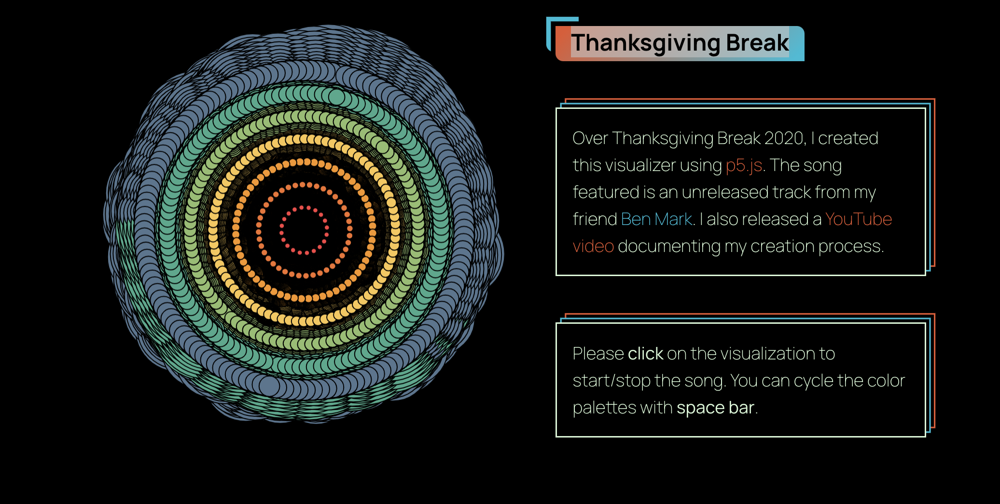
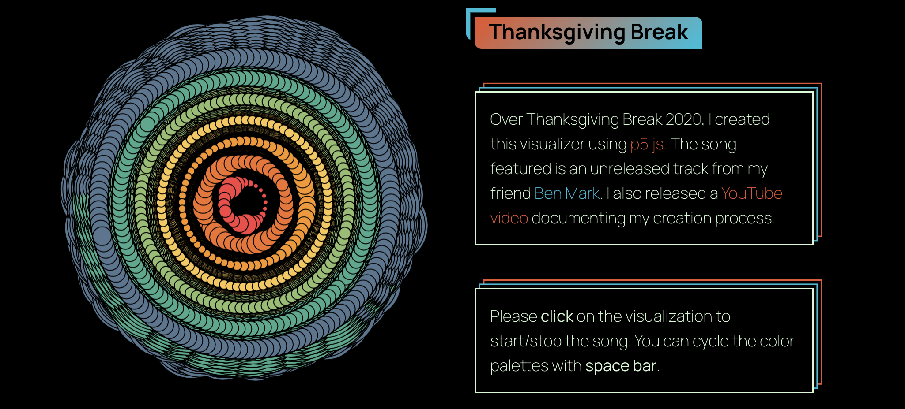
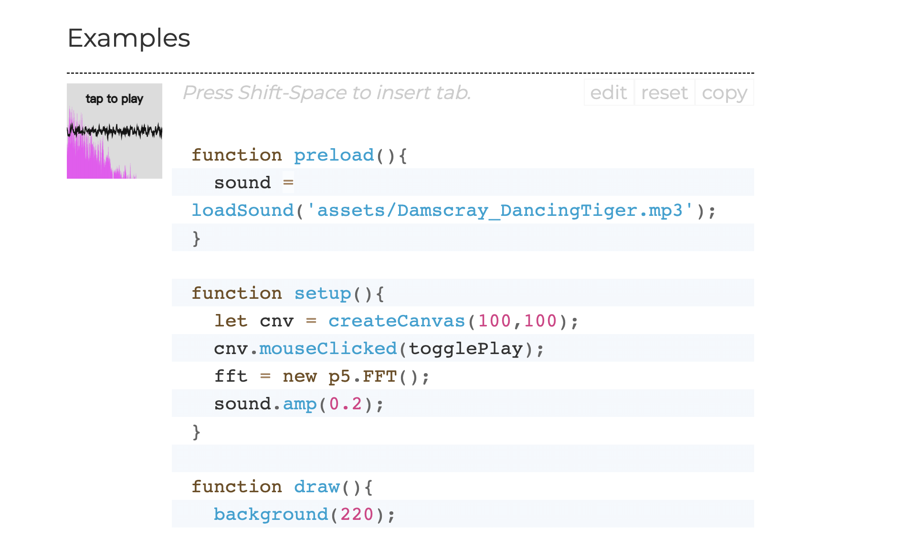

# ygao0000_9103_tut8

# Part 1: Imaging Technique Inspiration

[Link Text](https://www.maxemitchell.com/code_art/thanksgiving_break)

I would like to incorporate the audio visualization and user interaction techniques from the example into my project. The addition of music brings more energy to the coding, and the way the circles randomly move with the music makes it possible to visualize the sound. The colorful design of the colors makes the entire scene eye-catching. This technique provides a combined visual and auditory experience, which is very engaging and appealing.

# Part 2:Coding Technique Exploration

## Coding technology：p5.FFT

FFT (Fast Fourier Transform) is an analysis algorithm that isolates individual audio frequencies within a waveform.

This coding technique can analyze an audio source and visualize its waveform, making sound visible. By utilizing this technique and incorporating design elements, you can achieve the desired visual effects like those shown in the example.

[Link Text](https://p5js.org/reference/#/p5.FFT)