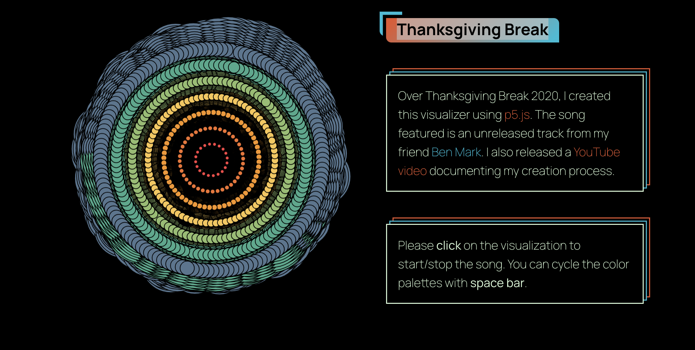

# ygao0000_9103_tut8

# Part 1: Imaging Technique Inspiration

I would like to incorporate the audio visualization and user interaction techniques from the example into my project. The addition of music brings more energy to the coding, and the way the circles randomly move with the music makes it possible to visualize the sound. The colorful design of the colors makes the entire scene eye-catching. This technique provides a combined visual and auditory experience, which is very engaging and appealing.