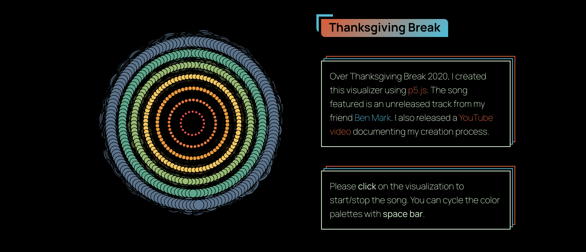
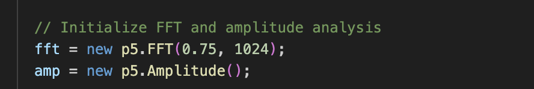
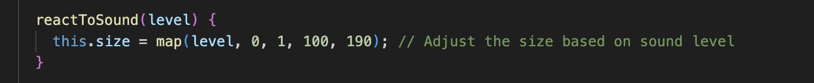
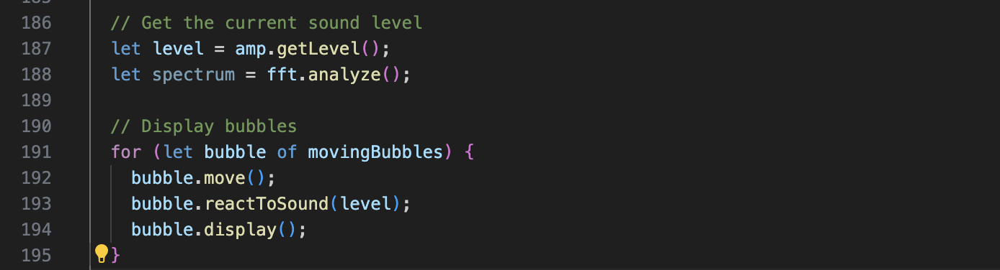
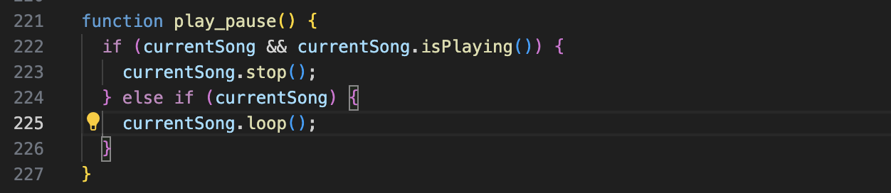
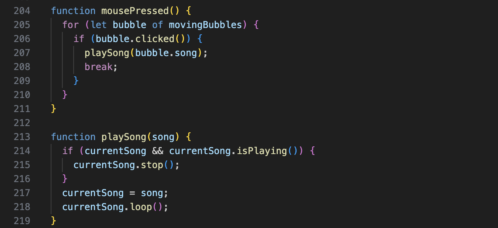

# ygao0000_9103_tut8
# Bubble of Emotions Animation Project

## How to Interact
- Play Music: Click on any bubble to play the corresponding song. Each bubble represents a different emotion and will trigger a unique audio file.
- Pause/Resume Music: Use the "Play/Stop" button at the bottom of the screen to pause or resume the currently playing song.
- Observe Animation: Move the mouse slowly over the screen to interact with the bubbles. Notice how the bubbles move and change size in response to the audio being played.
- Responsive Bubbles: Watch how the size of the bubbles reacts to the sound level of the playing audio, creating a dynamic visual experience.

## Individual Approach
- Audio Interaction: My code uniquely drives the animation based on audio input, making the bubbles react to the sound level of the playing song.
- Gradient Colors and Text Effects: The use of gradient colors and dynamic text effects within the bubbles sets my animation apart, providing a visually engaging experience.

## Inspiration

[Link Text](https://www.maxemitchell.com/code_art/thanksgiving_break)

I was inspired by the visualization of sound waves and how they create fascinating patterns on audio input. The idea of moving the bubbles around and changing their size depending on the sound level came from looking at various sound visualization tools and their ability to turn audio into dynamic visuals.

Our group code presents a presentation for emotions, and in my code I allow the user to interact with different bubbles based on the mood of the moment by adding the appropriate audio to the different mood bubbles.

## Technical Explanation
My individual code achieves audio-driven animation through the following steps:

1. **Preloading Audio Files:**

In the preload function, the background music file assets/bgm.mp3 is loaded using the loadSound function. Preloading ensures the audio file is ready to use when the program starts running.

2. **Initializing Audio Analysis:**

In the setup function, a p5.Amplitude object is created to analyze the amplitude of the audio. This allows us to get the real-time sound level of the audio, which drives the animation effects.

3. **Defining the MovingBubble Class:**

The MovingBubble class defines the properties and behaviors of the bubbles, including position, size, color, noise offset, movement speed, and scaling effect.
The newly added reactToSound method adjusts the bubble size based on the audio amplitude, enabling the bubbles to respond to the currently playing audio.

4. **Moving and Displaying Bubbles:**

The move method controls the movement of the bubbles on the canvas, ensuring they do not go out of bounds.
The display method draws the bubbles with gradient colors and uses noise functions to create dynamic shapes and effects.

5. **Drawing Function:**

In the draw function, the current audio amplitude is obtained, and the reactToSound method is called to make the bubbles dynamically adjust their size based on the audio's sound level.
Meanwhile, the background is rendered using Perlin noise to create dynamic wave effects, enhancing the visual dynamism.

6. **Play/Pause Functionality:**

The play_pause function controls the playback of the audio. When the "Play/Stop" button is clicked, it toggles between playing and stopping the audio.

7. **Mouse Click to Play Music:**

By clicking on a bubble, the corresponding music is played, enhancing the interactive experience. Clicking any bubble triggers the audio file associated with that bubble.
